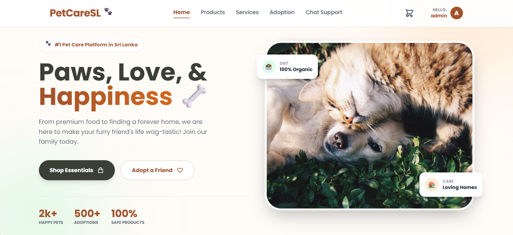
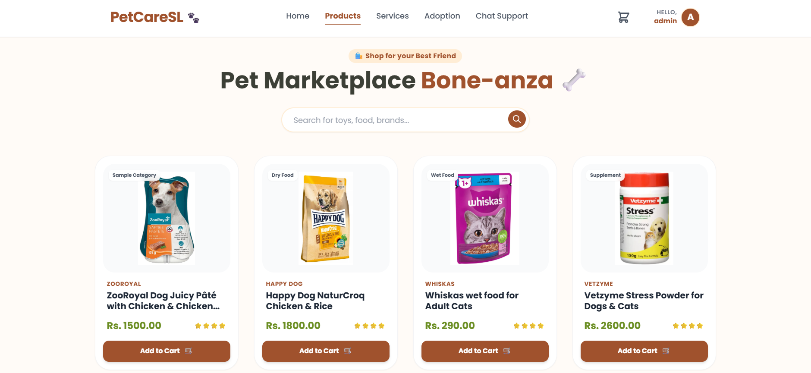
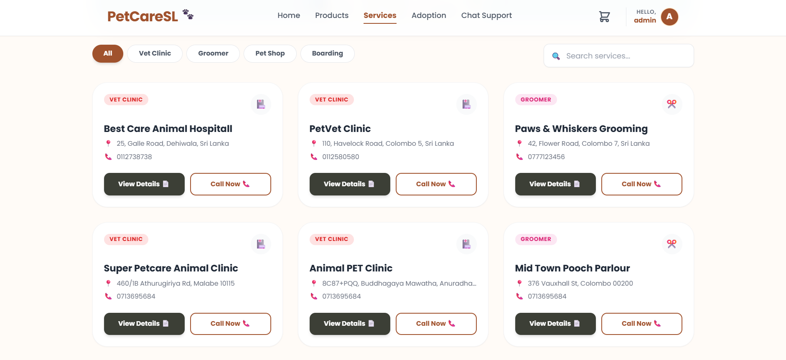
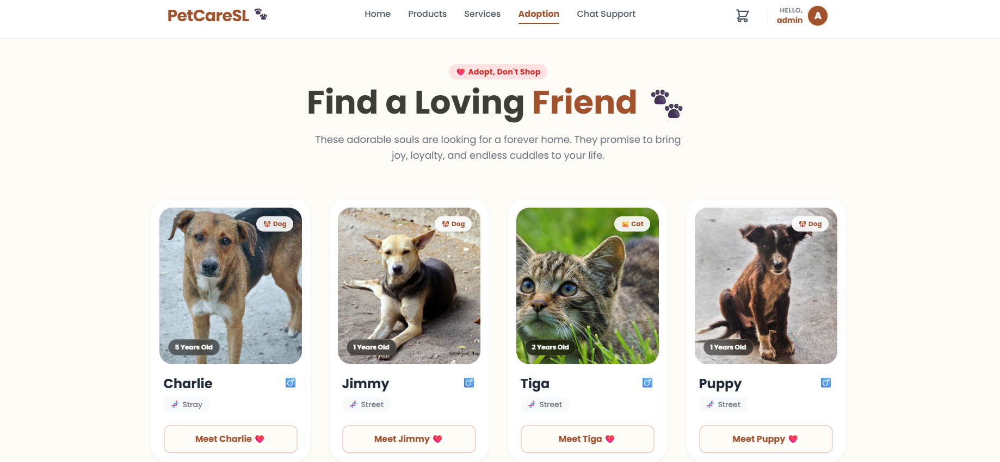
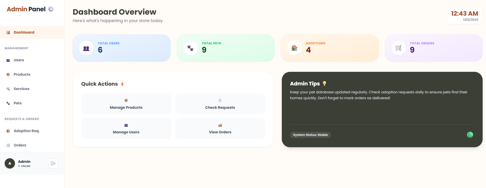
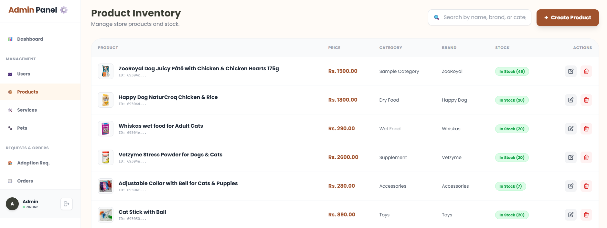
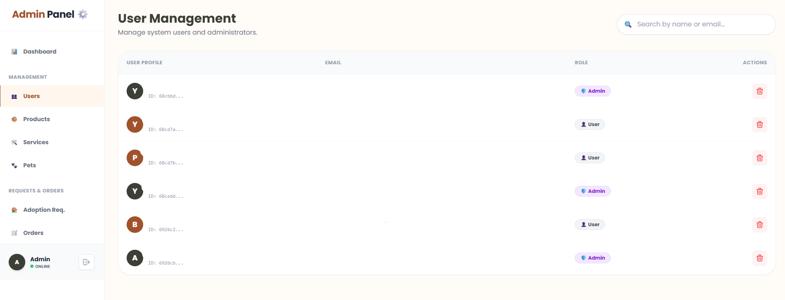
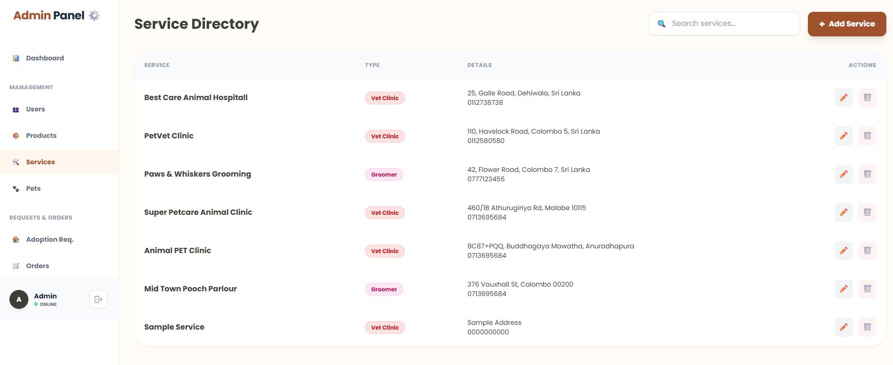

# 🐾 PetCareSL - The Ultimate AI-Powered Pet Care Hub for Sri Lanka



**PetCareSL** is a comprehensive, full-stack web platform designed to digitize the pet care experience in Sri Lanka. It combines modern e-commerce, adoption services, and AI-powered assistance into a single, user-friendly ecosystem.

Whether you are looking to adopt a new friend, buy supplies, find a vet, or get instant pet care advice, PetCareSL has you covered.

---

## ✨ Key Features

### 🧠 1. AI-Powered Smart Assistant (The Brain)
* **RAG Chatbot:** Built with **LangChain**, utilizing **Google Gemini 2.0 Flash** for reasoning and **Cohere** for embeddings.
* **Knowledge Base:** Uses a local PDF knowledge base processed into a **FAISS** vector store for accurate, context-aware answers.
* **Context Aware:** Remembers conversation history for a natural dialogue flow.

### 🛍️ 2. E-Commerce Marketplace
* **Product Catalog:** Browse a wide range of pet foods, toys, and accessories.
* **Smart Cart & Checkout:** Full cart functionality with real-time stock management.
* **Stock Control:** Automatically updates inventory levels upon purchase to prevent overselling.
* **Order Management:** Users can track orders; Admins can manage and update order statuses.

### 🏠 3. Pet Adoption Center (The Heart)
* **Adoption Listings:** View profiles of pets looking for a forever home.
* **Request System:** Users can submit adoption requests directly through the platform.
* **"My Pets" Dashboard:** Once an adoption is approved by an Admin, the pet automatically moves to the user's "My Pets" profile.

### 🏥 4. Service Directory & Maps
* **Locator:** Find Vet Clinics, Groomers, and Pet Shops nearby.
* **Interactive Maps:** Powered by **Leaflet.js**, visualizing service locations on an interactive map of Sri Lanka.

### 👮‍♂️ 5. Powerful Admin Dashboard
* **Overview:** Real-time stats on users, orders, pets, and adoptions.
* **Management:** Full CRUD (Create, Read, Update, Delete) capabilities for Products, Pets, Services, and Users.
* **Order Handling:** Mark orders as "Delivered".
* **Adoption Approvals:** Review and Approve/Reject adoption requests.

---

## 🛠️ Tech Stack

This project utilizes a **Microservices-inspired Architecture** separating the AI logic from the main application backend.

### **Frontend (The Face)**
* **Framework:** React.js
* **Routing:** React Router DOM
* **Styling:** Tailwind CSS (Modern & Responsive)
* **State Management:** React Context API
* **Notifications:** React Toastify & SweetAlert2
* **Maps:** React Leaflet

### **Backend (The Core)**
* **Runtime:** Node.js
* **Framework:** Express.js
* **Database:** MongoDB (Atlas) with Mongoose ODM
* **Authentication:** JSON Web Tokens (JWT)
* **File Uploads:** Multer

### **AI Service (The Intelligence)**
* **Language:** Python
* **API Framework:** FastAPI
* **LLM Orchestration:** LangChain
* **LLM Model:** Google Gemini 2.0 Flash
* **Embeddings:** Cohere (embed-english-v3.0)
* **Vector Store:** FAISS (Facebook AI Similarity Search)

---

## 🚀 Installation & Setup Guide

Follow these steps to set up the project locally.

### Prerequisites
* Node.js (v14+)
* Python (v3.9+)
* MongoDB Instance (Local or Atlas)

### 1. Clone the Repository
```bash
git clone [https://github.com/WAPunsisiYemaniPerera/PetCareSL.git](https://github.com/WAPunsisiYemaniPerera/PetCareSL.git)
cd PetCareSL
```

### 2. Backend Setup (Node.js)
Navigate to the backend folder and install dependencies.
```bash
cd backend
npm install
```
Create a .env file in the backend folder and add the following:
```bash
PORT=5000
MONGO_URI=your_mongodb_connection_string
JWT_SECRET=your_jwt_secret_key
```
Start the Server:
```bash
npm start
```
Backend runs on: http://localhost:5000

### 3. AI Service Setup (Python)
Navigate to the chatbot folder.
```bash
cd ../chatbot
```
Create a Virtual Environment & Install Dependencies:
```bash
python -m venv venv

# Windows:
.\venv\Scripts\activate

# Mac/Linux:
source venv/bin/activate

pip install -r requirements.txt
```
Create a .env file in the chatbot folder and add your API keys:
```bash
GOOGLE_API_KEY=your_google_gemini_api_key
COHERE_API_KEY=your_cohere_api_key
```
First Time Setup (Create Vector DB): Run the script to process the PDF and create the FAISS index.
```bash
python create_vector_db.py
```
Start the AI API Server:
```bash
python -m uvicorn main:app --reload --host 127.0.0.1 --port 8000
```
AI Service runs on: http://localhost:8000

### 4. Frontend Setup (React)
Navigate to the frontend folder.
```bash
cd ../frontend
npm install
```
Start the React App:
```bash
npm start
```

### 📸 Screenshots
| Home | Marketplace |
|:---:|:---:|
|  |  |

| Services | Adoption |
|:---:|:---:|
|  |  |

| Admin Dashboard | Admin Product Inventory |
|:---:|:---:|
|  |  |

| Admin User Management | Admin Service Management |
|:---:|:---:|
|  |  |